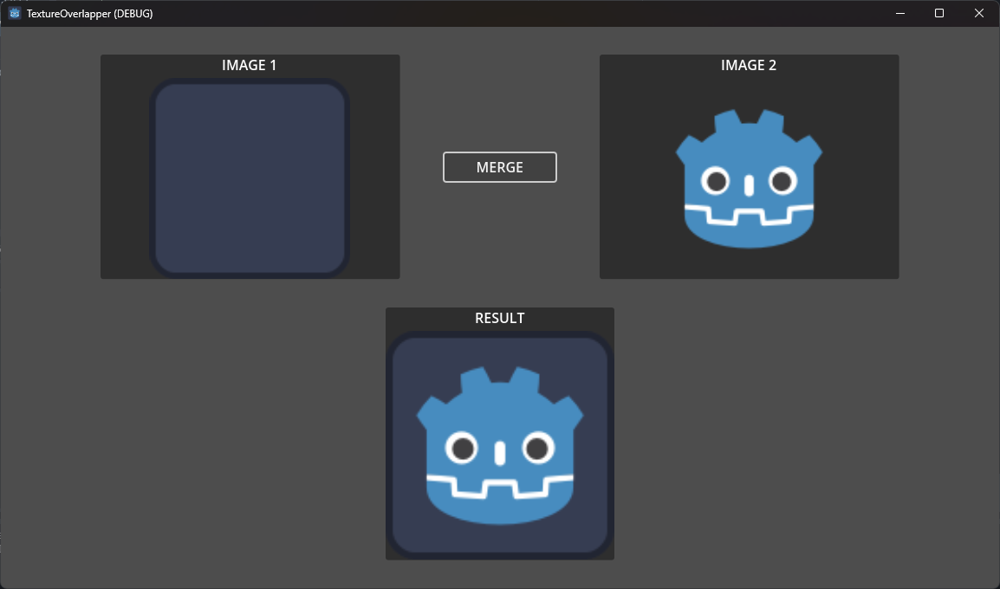

# Godot Texture Overlapper
Contains a [TextureOverlapper](./texture_overlapper.gd) class and a example of use.

[TextureOverlapper](./texture_overlapper.gd) class can be imported in any godot project and is ready to use.

This class only contains the method `overlap` that merge two textures by overlapping it and returns a new and merged image.

With this approach, merge two textures becomes as simple as calling:
```
var merged_texture = TextureOverlapper.overlap(texture1, texture2)
```

Fell free to use and modify this code as you want as well as submit your suggestions of new implementations as pull requests here.

# Screenshot


# Why overlap textures?
There are lots of use cases where you can't just draw two Sprite2D or TextureRect nodes one over another.

If you have a Skeleton2D controlling a texturized Polygon2D, for instance, draw a static texture over the polygon **wont** inherit the Skeleton effect and duplicate the polygon changing the texture you want is not an mainteanable approach. For this scenario, you problably gonna want to merge textures and apply the merged texture in the polygon.

# Performance warning
Keep in mind that we are using the Texture2D.getImage() method. This will fetch the texture data from the GPU, which might cause performance problems when overused. See [Godot Documentation](https://docs.godotengine.org/en/stable/classes/class_texture2d.html#class-texture2d-method-get-image) for more information.